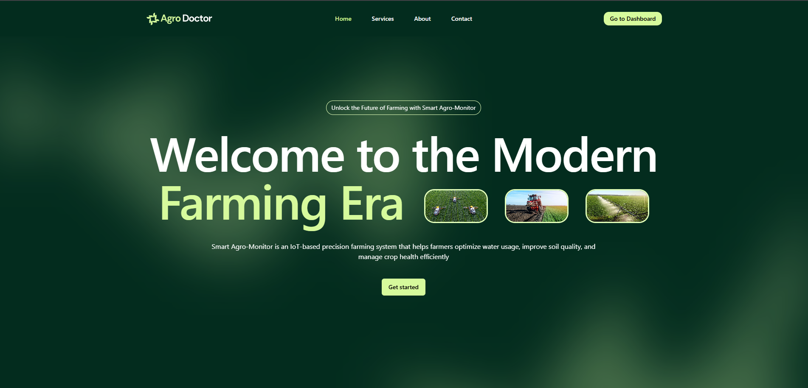
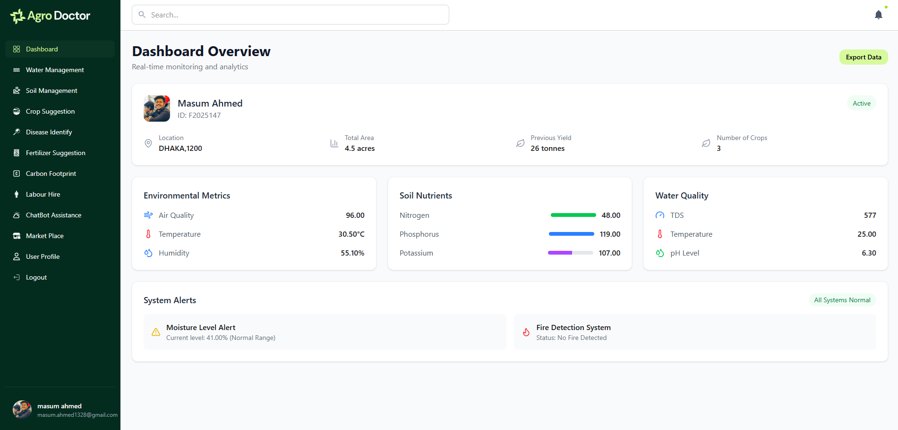

# Agro Doctor

Agro Doctor is a **hardware and application-based project** designed for university purposes. The project integrates a **frontend web application** with **Firebase Realtime Database** to deliver real-time agricultural insights. The hardware component, built by teammates, works alongside the web platform to enhance functionality.

## 🚀 Live Demo
🔗 **[Agro Doctor Live Site](https://agro-doctor.netlify.app/)**  
🔗 **[GitHub Repository](https://github.com/MasumAhmed19/agro-doctor-client/)**  





## 📌 Features
- 🔐 **Google Authentication** – Users can log in via Google Sign-In.
- 📊 **Dashboard Access** – Users can navigate to the dashboard to check relevant data.
- 🌍 **Real-time Database Integration** – Fetch and display live agricultural data.
- 🎨 **Modern UI with TailwindCSS** – A responsive and visually appealing design.
- 🔄 **React Query for State Management** – Efficient data fetching and caching.
- 📍 **Map Integration (React Leaflet)** – Display location-based agricultural insights.
- 🔜 **Upcoming Features** – More enhancements to come soon!

## 📁 Table of Contents
- [Installation](#-installation)
- [Usage](#-usage)
- [Configuration](#-configuration)
- [Dependencies](#-dependencies)
- [Contributors](#-contributors)

## 🛠 Installation
To run Agro Doctor locally, follow these steps:

1. **Clone the repository**:
   ```sh
   git clone https://github.com/MasumAhmed19/agro-doctor-client.git
   cd agro-doctor-client
   ```

2. **Install dependencies**:
   ```sh
   npm install
   ```

3. **Set up environment variables**:  
   Create a `.env.local` file in the root directory and add the following:
   ```ini
   VITE_apiKey=your_api_key
   VITE_authDomain=your_auth_domain
   VITE_databaseURL=your_database_url
   VITE_projectId=your_project_id
   VITE_storageBucket=your_storage_bucket
   VITE_messagingSenderId=your_messaging_sender_id
   VITE_appId=your_app_id
   VITE_measurementId=your_measurement_id
   ```
   🚨 **Important:** Do not expose your Firebase credentials publicly!

4. **Run the development server**:
   ```sh
   npm run dev
   ```
   Your application should now be running on `http://localhost:5173`.

## 🎯 Usage
1. Visit the **[live site](https://agro-doctor.netlify.app/)** or run locally.
2. Sign in using **Google Authentication**.
3. Navigate to the **Dashboard**.
4. Explore available features such as real-time data visualization.

## ⚙️ Configuration
Agro Doctor uses **Firebase** as the backend. Ensure you have configured your **Firebase project** and enabled **Google Authentication** in Firebase Console.

## 📦 Dependencies
This project is built using the following technologies:

```json
"dependencies": {
  "@gsap/react": "^2.1.2",
  "@headlessui/react": "^0.0.0-insiders.0a8de01",
  "@heroicons/react": "^2.2.0",
  "@tailwindcss/vite": "^4.0.6",
  "@tanstack/react-query": "^5.66.0",
  "axios": "^1.7.9",
  "firebase": "^11.3.0",
  "lucide-react": "^0.479.0",
  "preline": "^3.0.0",
  "react": "^19.0.0",
  "react-dom": "^19.0.0",
  "react-hot-toast": "^2.5.1",
  "react-icons": "^5.4.0",
  "react-leaflet": "^5.0.0-rc.2",
  "react-router-dom": "^7.1.5",
  "react-spinners": "^0.15.0",
  "react-toastify": "^11.0.3",
  "recharts": "^2.15.1",
  "tailwindcss": "^4.0.6"
}
```

## 👨‍💻 Contributors
- **Frontend Developer:** [Masum Ahmed](https://github.com/MasumAhmed19)
- **Hardware and Backend:** My university Seniors and batchmates


